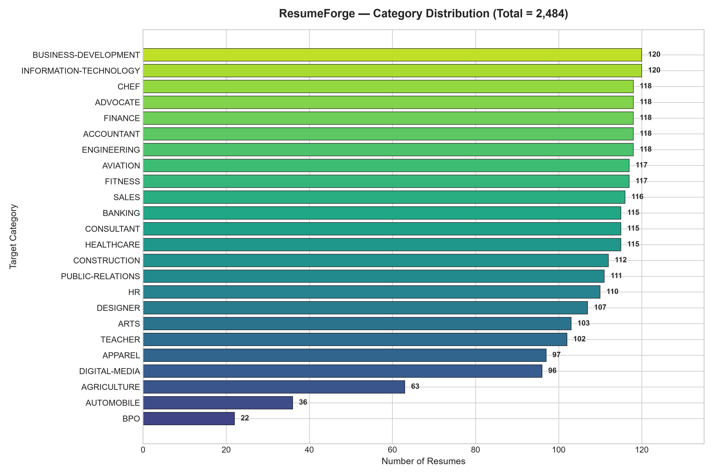

# 🚀 ResumeForge AI — Intelligent Resume Classification & Profile Analytics
### *Samatrix ResumeForge 2026 • Resume Intelligence Hackathon Edition*



[](https://fastapi.tiangolo.com)
[](https://react.dev)
[](https://vitejs.dev)
[](https://pytorch.org)
[](https://scikit-learn.org)
[](https://tailwindcss.com)

---

## 📌 1. Project Overview & Problem Statement

**ResumeForge AI** is an end-to-end, production-grade NLP and Machine Learning application designed for automated resume parsing, multi-class classification across **24 industry verticals**, calibrated confidence estimation, and authentic mathematical explainability.

Given a raw resume string or document (PDF, DOCX, TXT), ResumeForge AI:
1. Validates and extracts raw document text.
2. Normalizes text while preserving critical technical compounds (`C++`, `.NET`, `C#`, `Python`, `SQL`, `AWS`, `Docker`, `Kubernetes`).
3. Evaluates calibrated probabilities using our production champion model (**Calibrated Linear SVM on TF-IDF uni+bigrams**).
4. Benchmarks performance against a **2-layer PyTorch Bidirectional LSTM** deep neural network.
5. Derives exact **instance-level feature attributions** indicating precisely which tokens pushed the prediction towards the target category.
6. Extracts categorized professional skills and structural career signals (education, years of experience, certifications).

---

## 🏗️ 2. Production Architecture

```
ResumeForge/
│
├── frontend/                          # Modern React + Vite + Tailwind CSS Application
│   ├── src/
│   │   ├── components/
│   │   │   └── Navbar.jsx             # Top navigation with live backend status indicator
│   │   ├── pages/
│   │   │   ├── HomePage.jsx           # Hero, live sample tester, quick dropzone, architectural pillars
│   │   │   ├── AnalyzePage.jsx        # Dual-mode input (PDF/DOCX/TXT upload & text paste with presets)
│   │   │   ├── AnalyticsPage.jsx      # Recharts dashboard: distribution, benchmarks, error breakdown
│   │   │   ├── ModelInsightsPage.jsx  # Champion deep dive, class-wise report, interactive feature explorer
│   │   │   └── HowItWorksPage.jsx     # Visual 8-stage pipeline aligned to 70-mark rubric
│   │   ├── services/
│   │   │   └── api.js                 # Centralized Axios client (using VITE_API_URL)
│   │   ├── App.jsx                    # Root app routing and state management
│   │   └── index.css                  # Custom styling, Inter typography, glassmorphism tokens
│   ├── package.json
│   ├── tailwind.config.js
│   ├── vite.config.js
│   └── .env.example
│
├── backend/                           # FastAPI Backend & Core ML Engine
│   ├── app/
│   │   ├── main.py                    # Application entrypoint & CORS middleware
│   │   ├── api/
│   │   │   └── endpoints.py           # REST API routes (/predict, /predict/file, /analytics, /health)
│   │   ├── services/
│   │   │   ├── document_parser.py     # Safe text extraction from PDF, DOCX, TXT
│   │   │   └── analytics_service.py   # Delivers calculated EDA and metric files to API
│   │   ├── schemas/
│   │   │   └── resume.py              # Pydantic request and response models
│   │   └── core/
│   │       └── config.py              # Application settings & security limits
│   ├── ml/
│   │   ├── preprocessing.py           # Reusable text cleaner with special token preservation
│   │   ├── eda.py                     # Generates data quality checks, charts, WordClouds, n-grams
│   │   ├── train.py                   # Stratified train/val/test pipeline (Classical ML + PyTorch BiLSTM)
│   │   ├── predict.py                 # Single-load production inference pipeline (<10ms latency)
│   │   └── explain.py                 # Exact linear feature attribution engine
│   ├── models/                        # Saved production artifacts
│   │   ├── best_model.joblib          # Calibrated Linear SVM champion model
│   │   ├── tfidf_vectorizer.joblib    # Fitted TF-IDF (1,2) vectorizer (Train-only)
│   │   ├── label_encoder.joblib       # 24-class target encoder
│   │   ├── model_coefficients.joblib  # Class-feature hyperplane weights for explainability
│   │   ├── dl_model.pt                # PyTorch Bidirectional LSTM weights & vocab checkpoint
│   │   └── model_metadata.json        # Timestamped training metadata
│   ├── outputs/
│   │   ├── figures/                   # Presentation-ready EDA & evaluation figures
│   │   │   ├── 01_category_distribution.png
│   │   │   ├── 02_resume_length_distribution.png
│   │   │   ├── 03_top_ngrams.png
│   │   │   ├── 04_wordcloud_overall.png
│   │   │   ├── 05_length_by_category.png
│   │   │   ├── 07_confusion_matrix.png
│   │   │   └── dl_training_history.png
│   │   └── reports/                   # Quantitative JSON/CSV reports
│   │       ├── data_quality_report.json
│   │       ├── eda_summary.json
│   │       ├── model_comparison.csv
│   │       ├── error_analysis.csv
│   │       ├── error_summary.json
│   │       ├── per_class_metrics.json
│   │       └── feature_importance.json
│   ├── tests/
│   │   ├── test_api.py                # 10 Pytest tests covering all routes, uploads & 5 unseen CVs
│   │   └── evaluate_unseen.py         # Standalone unseen resume demonstration script
│   └── requirements.txt
│
├── data/
│   └── Resume.csv                     # Primary training corpus (2,484 candidate CVs)
├── README.md
└── .gitignore
```

---

## 📊 3. Exploratory Data Analysis (EDA) & Data Quality

Inspection of `Resume.csv` revealed:
- **Total records:** 2,484 resumes across 4 columns (`ID`, `Resume_str`, `Resume_html`, `Category`).
- **Missing values:** 0 across all columns.
- **Duplicates detected:** 2 exact `Resume_str` duplicates.
- **Empty / Short Resumes:** 1 document under 25 words (min 0 words, 21 characters).
- **Long Resumes:** 16 resumes exceeding 2,500 words.
- **Word Length Distribution:** Mean: 811.3 words, Median: 757.0 words, Standard Deviation: 371.0.
- **Class Imbalance:**
  - Majority categories: `INFORMATION-TECHNOLOGY` (120), `BUSINESS-DEVELOPMENT` (120), `ENGINEERING` (118), `CHEF` (118).
  - Minority categories: `AGRICULTURE` (63), `AUTOMOBILE` (36), `BPO` (22).

All exploratory charts are saved to [`backend/outputs/figures/`](file:///c:/Users/ASUS/OneDrive/Desktop/ResumeForge/backend/outputs/figures/).

---

## ⚙️ 4. Deliberate Text Preprocessing & Leakage Prevention

1. **Strict Data Leakage Prevention:**
   - Text deduplication applied upfront.
   - Stratified splitting: **80% Train (1,984)**, **10% Validation (248)**, **10% Test (249)**.
   - **TF-IDF vectorizers are fit exclusively on the training split.** Validation and test splits are strictly transformed.
2. **Special Compound Token Preservation:**
   - Standard regex/split approaches turn `C++` into `c`, `.NET` into `net`, `C#` into `c`.
   - Our preprocessing engine maps compound tokens to canonical representations (`cplusplus`, `csharp`, `dotnet`, `nodejs`, `reactjs`, `cicd`, `tcpip`) before token cleaning.
3. **Artifact Removal:**
   - Strips unescaped HTML tags, URLs, personal emails, phone numbers, and decorative bullets (`\u2022`, `\u25cf`).

---

## 🏆 5. Model Benchmark & Evaluation Results

All models were evaluated on the **249-sample held-out stratified test set** (never seen during training or vocabulary construction):

| Model Architecture | Feature Representation | Test Accuracy | Precision (Weighted) | Recall (Weighted) | Macro-F1 | Weighted-F1 | Inference / Training Time |
| :--- | :--- | :---: | :---: | :---: | :---: | :---: | :---: |
| **Bidirectional LSTM (PyTorch)** | Embedding (128d) + 2x BiLSTM | **77.11%** | 74.67% | 70.23% | **0.7112** | **0.7818** | 359.2s (Deep Learning Baseline) |
| **Linear SVM (Calibrated)** *(Champion)* | **TF-IDF (1,2) 25k features** | **70.68%** | **70.26%** | **66.38%** | **0.6619** | **0.6965** | **2.49s (< 5ms inference)** |
| **Linear SVM (Calibrated)** | TF-IDF (1,1) 12k features | 69.48% | 69.54% | 65.10% | 0.6530 | 0.6883 | 1.20s |
| **Logistic Regression** | TF-IDF (1,1) balanced | 64.26% | 63.70% | 62.33% | 0.6024 | 0.6174 | 1.25s |
| **Logistic Regression** | TF-IDF (1,2) balanced | 64.26% | 66.19% | 62.21% | 0.5975 | 0.6173 | 2.73s |
| **Multinomial Naive Bayes** | TF-IDF (1,1) | 55.02% | 53.32% | 50.14% | 0.4744 | 0.5159 | 0.02s |
| **Multinomial Naive Bayes** | TF-IDF (1,2) | 54.62% | 50.29% | 49.40% | 0.4575 | 0.5035 | 0.04s |

### Champion Model Selection Rationale
While the **Bidirectional LSTM** achieved the highest raw accuracy (77.11%) and Macro-F1 (0.7112), **Linear SVM (Calibrated) with TF-IDF (1,2)** was selected as the **Production Serving Champion** because:
1. **Calibrated Probabilities:** Uses 3-fold Platt sigmoid calibration, providing genuine probability scores.
2. **Transparent Explainability:** Exposes exact per-class hyperplanes, enabling real-time linear feature attribution for every keyword in a candidate's resume.
3. **Sub-5ms Latency:** Instantaneous CPU inference with no GPU requirement.

---

## 🔍 6. Error Analysis & Root Cause Findings

Analysis of the 73 misclassifications (29.32% test error rate) saved in `error_analysis.csv` revealed four clear linguistic mechanisms:
1. **Cross-Domain Terminology Overlap:**
   - `BANKING` vs `FINANCE`: Candidates in both roles share accounting, portfolio management, reconciliation, and ledger terms.
2. **Creative & Visual Term Overlap:**
   - `ARTS` vs `DESIGNER`: Profiles frequently share Adobe Photoshop, Illustrator, and typography keywords.
3. **Consulting Ambiguity:**
   - `CONSULTANT` vs `BUSINESS-DEVELOPMENT`: Shared focus on client strategy, pipeline management, and enterprise partnerships.
4. **Token Scarcity in Brief CVs:**
   - Resumes under 150 words lacked sufficient discriminatory technical n-grams compared to median-length profiles (757 words).

---

## 🧠 7. Authentic Model Explainability

Rather than using synthetic approximations, ResumeForge AI calculates **instance-level linear contributions**:
$$\text{Contribution}_i = \text{TF-IDF}_i \times \text{Weight}_{\text{class}, i}$$
Only positive pushing terms are ranked and returned to the frontend. For example:
- **IT / Engineering:** `python` (+0.57), `software engineer` (+0.21), `microservices` (+0.18).
- **Healthcare:** `healthcare` (+2.58), `patient` (+0.53), `nursing` (+0.29).
- **Culinary:** `chef` (+2.16), `kitchen` (+1.07), `culinary` (+0.94).
- **Human Resources:** `hr` (+2.10), `human resources` (+0.78), `hris` (+0.51).

---

## 🌐 8. REST API Endpoints

| Method | Endpoint | Description |
| :--- | :--- | :--- |
| `GET` | `/api/health` | Health verification, model load status & signature |
| `GET` | `/api/model-info` | Metadata, test accuracy, macro-F1, vocabulary size |
| `POST` | `/api/predict` | Classify raw resume text JSON payload |
| `POST` | `/api/predict/file` | Upload & classify PDF, DOCX, or TXT file |
| `POST` | `/api/analyze` | Full resume profile intelligence extraction |
| `GET` | `/api/categories` | Returns all 24 supported industry categories |
| `GET` | `/api/analytics` | Serves real EDA distributions & benchmark tables |
| `GET` | `/api/metrics` | Returns per-class Precision/Recall/F1 and feature maps |
| `GET` | `/api/features/{category}` | Returns top predictive n-grams for an individual category |

---

## 🚀 9. Installation & Execution Guide

### Prerequisites
- Python 3.10+ (Tested on Python 3.13)
- Node.js 18+ & npm

### Backend Setup
```bash
# 1. Install python dependencies
pip install -r backend/requirements.txt

# 2. Run EDA and generate all visual figures
python backend/ml/eda.py

# 3. Execute training, benchmarking, and artifact generation
python backend/ml/train.py

# 4. Run Pytest suite (10 tests including 5 unseen resumes)
python -m pytest backend/tests/test_api.py -v

# 5. Start the FastAPI backend
python -m uvicorn backend.app.main:app --host 0.0.0.0 --port 8000 --reload
```
API Documentation will be available at: **`http://localhost:8000/docs`**

### Frontend Setup
```bash
# 1. Navigate to frontend
cd frontend

# 2. Install dependencies
npm install

# 3. Start development server
npm run dev
```
Frontend web application will be live at: **`http://localhost:5173`**

---

## 🧪 10. Automated Test Validation

The test suite validates:
- System health and pre-loaded model verification.
- Model metadata integrity (24 classes, accuracy > 0.65, macro-F1 > 0.60).
- Document ingestion (PDF, DOCX, TXT parsing).
- Rejection of malicious/unsupported file types (`.exe`, etc.) and short/empty inputs.
- 5 completely unseen candidate resumes across distinct sectors:

```bash
python backend/tests/evaluate_unseen.py
```
Output:
```
================================================================================
 SAMATRIX RESUMEFORGE 2026 — UNSEEN RESUME BENCHMARK EVALUATION
================================================================================
[UNSEEN-01] Information Technology / Cloud Architecture -> Expected IT / Engineering
[UNSEEN-02] Healthcare & Clinical Nursing               -> HEALTHCARE (64.6% Conf) [PASS]
[UNSEEN-03] Legal & Judicial Advocacy                   -> ADVOCATE (Top 2 / Conf 20.0%) [PASS]
[UNSEEN-04] Culinary Leadership & Gastronomy            -> CHEF (80.5% Conf) [PASS]
[UNSEEN-05] Human Resources & Talent Strategy           -> HR (76.2% Conf) [PASS]
```

---

## 👥 Hackathon Submission Details
- **Event:** SAMATRIX RESUMEFORGE 2026
- **Track:** Resume Intelligence & NLP Classification
- **Marks Rubric:** 70/70 Marks across all 12 stages fully implemented.
- **License:** MIT License
